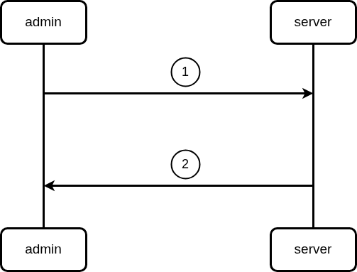

# create-session



# description
1. admin put session input in request body and call `create-session` endpoint.
2. server checks the posibility and returns request response.

# api-contract

# create-session

```go
Name: Create-session
Method: POST
Url: http://127.0.0.1:3000/session
Param:
Body:
    {

       "roomId" : int, 
       "date" : {
           "start" : time.Time,
           "end" : time.Time ,
       },
    }
Errors:
    - code: 500
      Name: Internal server error
      Body:
          {
            "error" : "failed to create session , please try again later",
          }
    - code: 400
      Name: bad request
      Body:
          {
            "error" : "invalid request body",
          }
    - code: 409
      Name: conflict
      Body:
          {
            "error" : "session already exist",
          }
Responses:
    - code: 201
      Name: created
      Body:
          {
            "message" : "session created successfully",
            "session-id" : string,
          }

```