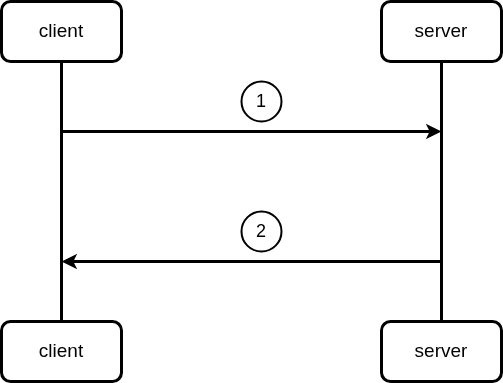

# reserve-seat



## description

1. user put session-id and target seat in request body and call reserve-seat endpoint.
2. server returns request's response

## api-contract

## reserve-seat

```go
Name: reservation
Method: POST
Url: http://127.0.0.1:3000/sessions/{session-id}/reservations
Header:
Params:
   - Name: session-id
     Type: string
Body:
   {
     "seat" : {
         row: int64,
         number: int64
     }
   }
Errors:
    - code: 500
      Name: Internal server error
      Body:
          {
            "error" : "failed to reserve session seats, try again later",
          }
    - code: 409
      Name: Conflict
      Body:
          {
            "error" : "seat already reserved",
          }
    - code: 404
      Name: not found
      Body:
          {
            "error" :  "seat does not exist",
          }
Responses:
    - code: 200
      Name: Ok
      Body:
        {
            "message" : "seat has been reserved successfuly",
            "data" : {
                "seat" : {
                    "number" : int64,
                    "row" : int64
                }
            },
            "purchase_link" : {
                "url"   : http://127.0.0.1:3000/example,
                "price" : float64,
                "expires-in-seconds" : int64,
            }
        }
```
